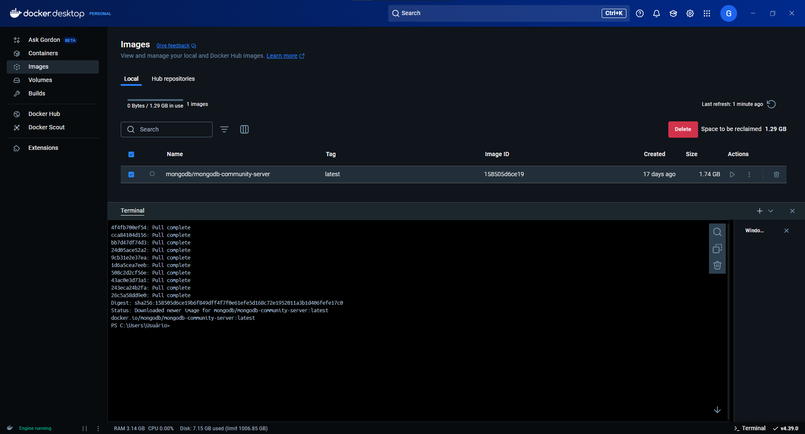
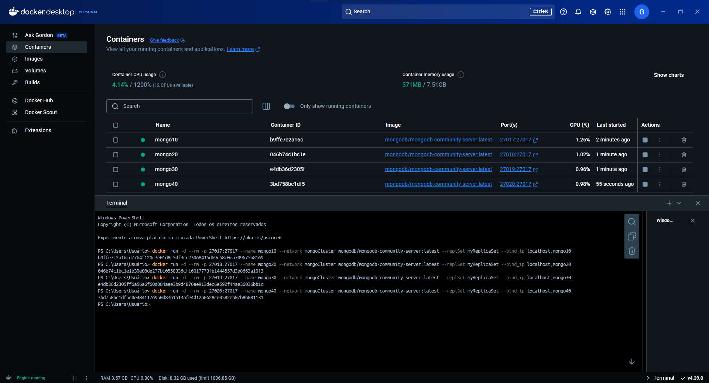
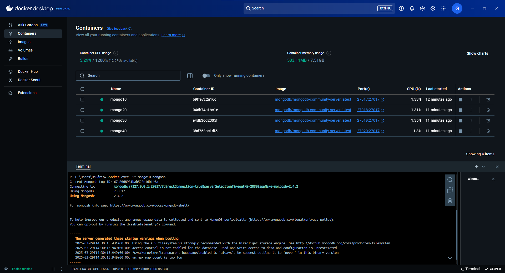
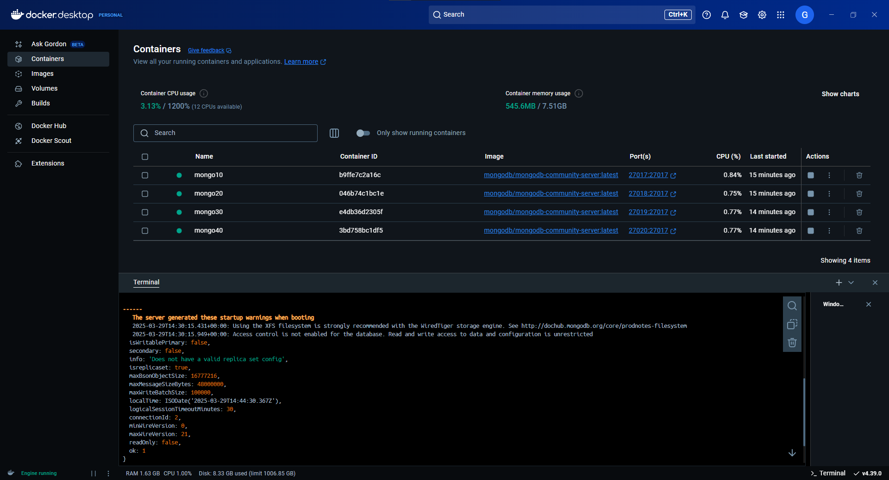

# DOCKER

> ## Comandos Docker

Primeiramente abra o seu terminal no docker e use o comando ``` docker pull mongodb/mongodb-community-server:latest ```, com isso você vai baixar a imagem para continuarmos o trabalho



Em seguida vamos usar o comando ``` docker network create [Nome_da_sua_network]  ```, em relação ao nome pode ser qualquer coisa que você tenha preferencia.


> ### Iniciando as intâncias 


Usaremos os comando:

Primeira instância;

 ``` docker run -d --rm -p 27017:27017 --name mongo10 --network [Nome_da_sua_network] mongodb/mongodb-community-server:latest --replSet myReplicaSet --bind_ip localhost,mongo10 ```

Segunda instância;

 ``` docker run -d --rm -p 27018:27017 --name mongo20 --network [Nome_da_sua_network] mongodb/mongodb-community-server:latest --replSet myReplicaSet --bind_ip localhost,mongo20 ```
 
Terceira instância;

 ``` docker run -d --rm -p 27019:27017 --name mongo30 --network [Nome_da_sua_network] mongodb/mongodb-community-server:latest --replSet myReplicaSet --bind_ip localhost,mongo30 ```

Quarta instância;

 ``` docker run -d --rm -p 27020:27017 --name mongo40 --network [Nome_da_sua_network] mongodb/mongodb-community-server:latest --replSet myReplicaSet --bind_ip localhost,mongo40 ```




> ### Explicação: 

 -d --> indica que este contêiner deve ser executado no modo desanexado (em segundo plano).

-p --> indica o mapeamento de porta. Qualquer solicitação de entrada na porta 27017 em sua máquina será redirecionada para a porta 27017 no contêiner.

--name --> indica o nome do contêiner. Este se tornará o nome do host desta máquina.

--network --> indica qual rede Docker usar. Todos os contêineres na mesma rede podem ver uns aos outros.

mongodb/mongodb-community-server:latest --> é a imagem que será usada pelo Docker. Esta imagem é o servidor MongoDB Community 

---

Após isso vamos usar o comando ``` docker exec -it mongo10 mongosh ``` e ele nos fornecera o link de conexão com o Mongo Compass.



Verifique se o container docker conectado está executando, com o comando:

``` db.runCommand ({hello:1}) ```

O retorno deverá ser parecido com: 



---

Execute o comando rs.initiate

``` rs.initiate ({ _id: "myReplicaSet", members:[{_id:0, host: "mongo10"}, {_id:1, host: "mongo20"}, {_id:2, host: "mongo30"}, {_id:3, host: "mongo40"}]}) ```


### Teste de verificação do conjunto de réplicas.

Agora você deve ter um conjunto de réplicas em execução. Se quiser verificar se tudo foi configurado corretamente, você pode usar a ferramenta CLI mongosh para avaliar a instrução rs.status(). Isso fornecerá a você o status do seu conjunto de réplicas, incluindo a lista de membros, Usando o comando ``` docker exec -it mongo10 mongosh --eval "rs.status()" ```.

Para continar vendo a explicação vamos verificar a parte do MongoDBCompass: 
[MongoDBCompass explicação](../MongoCompass_Commands/README.md)