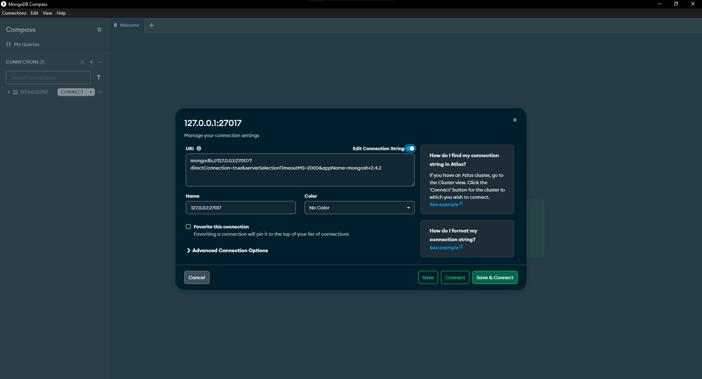
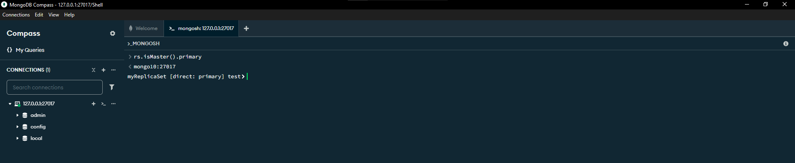
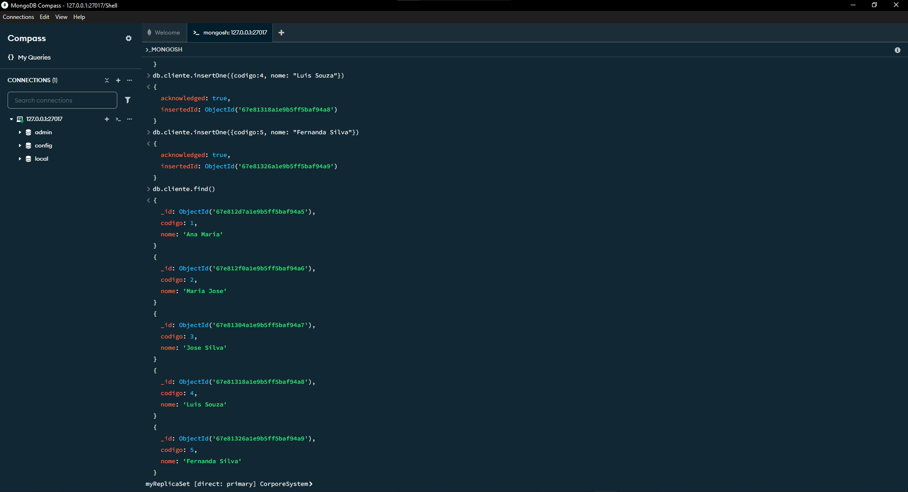
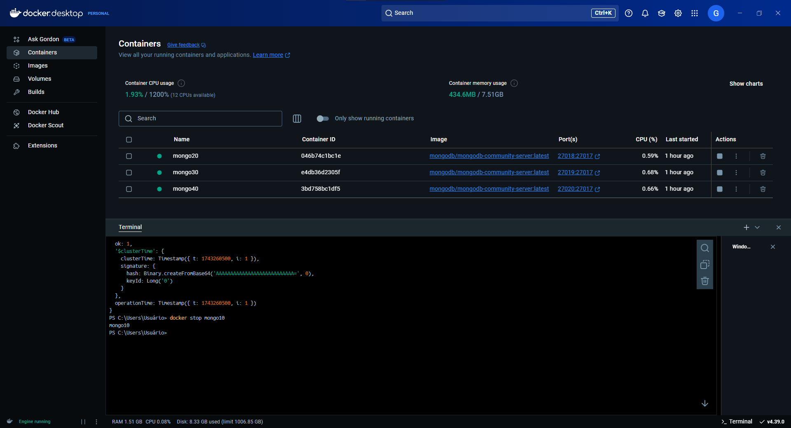
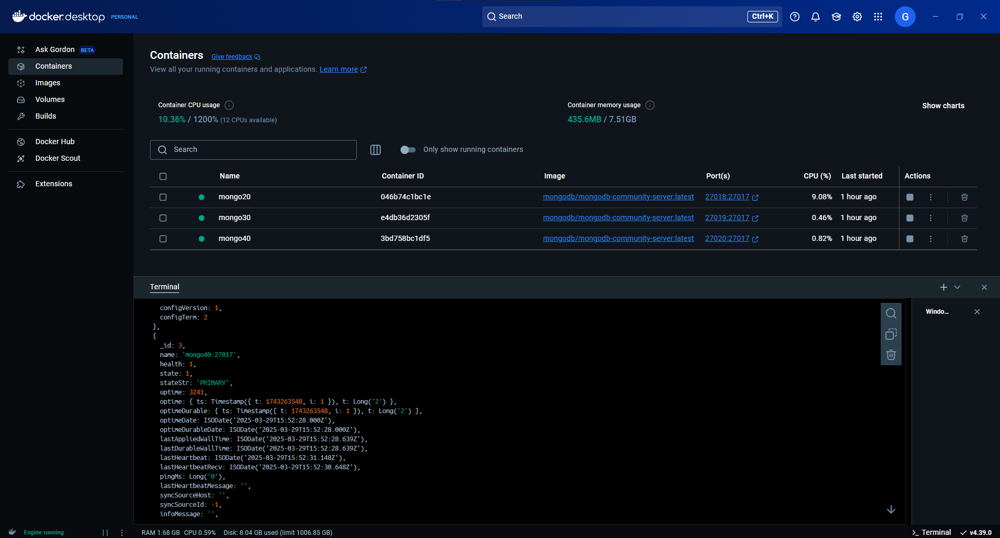
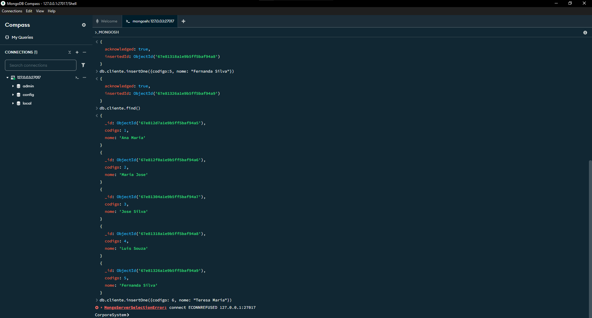
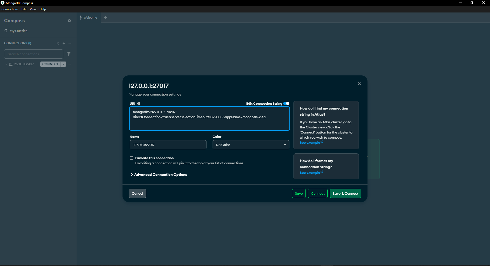
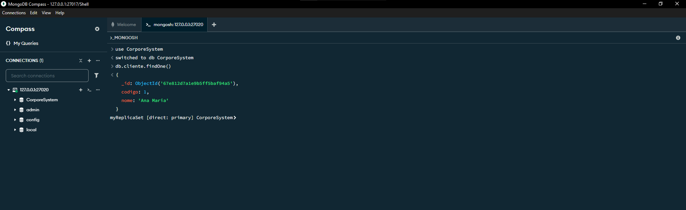
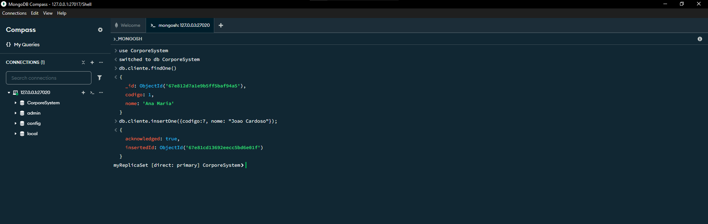

# Fazendo a conexão com o MongoDBCompass

Abra o MongoDBCompass e aperte para fazer uma nova conexão, após isso coloque o link que pegamos no terminal do docker:



---

Dentro do terminal do mongoSH vamos usar o camando ``` rs.isMaster().primary ```. Isso vai nos mostrar qual é a nosso conteiner primario.



---

Para verificar se seu conjunto de réplicas está funcionando, você pode tentar parar um dos contêineres com docker stop e tentar ler do seu banco de dados novamente.

``` use CorporeSystem ```
``` db.cliente.insertOne({codigo:1, nome: "Ana Maria"});```
``` db.cliente.insertOne({codigo:2, nome: "Maria Jose"});```
``` db.cliente.insertOne({codigo:3, nome: "Jose Silva"});```
``` db.cliente.insertOne({codigo:4, nome: "Luis Souza"});```
``` db.cliente.insertOne({codigo:5, nome: "Fernanda Silva"});```


``` db.cliente.find() ```

O retorno deve ser: 




> ### Voltando ao docker

Para verificar se seu conjunto de réplicas está funcionando, você pode tentar parar um dos contêineres com docker stop e tentar ler do seu banco de dados novamente.

``` docker stop mongo10 ```



Digite o comando abaixo para verificar o estado do cluster:

``` docker exec -it mongo20 mongosh --eval "rs.status()" ```



Como podemos ver a imagem acima foi sorteado novamente qual dos conteiners será o primario, nesse caso o meu foi o ` mongo 40 `

---

Faça um insert no MongoDBCompass e retornara um erro:

``` db.cliente.insertOne({codigo:6, nome: "Teresa Maria"}); ```



---

Abra outra conexão com a porta do Cluster primário, de acordo com o que o MongoDB elegeu, no meu caso o conteiner primario que foi elegido é o mongo27020:



---

Use o banco de dados CorporeSystem e faça a consulta do registro:

``` use CorporeSystem ```

``` db.cliente.findOne() ```



--- 

Faça uma nova inserção de dados e vamos perceber que o cluster continuou ativo:

``` db.cliente.insertOne({codigo:7, nome: "Joao Cardoso"}); ```



---

## Restabelecendo novamente o nó do cluster

### Volte novamente o nó mongo10

``` docker run -d --rm -p 27017:27017 --name mongo10 --network mongoCluster mongodb/mongodb-community-server:latest --replSet myReplicaSet --bind_ip localhost,mongo10 ```

Digite o comando abaixo para verificar o status do cluster:

``` docker exec -it mongo20 mongosh --eval "rs.status()" ```

Dessa forma, pudemos comprovar que o mongo se permaneceu disponível mesmo com a queda de um nó de cluster.

