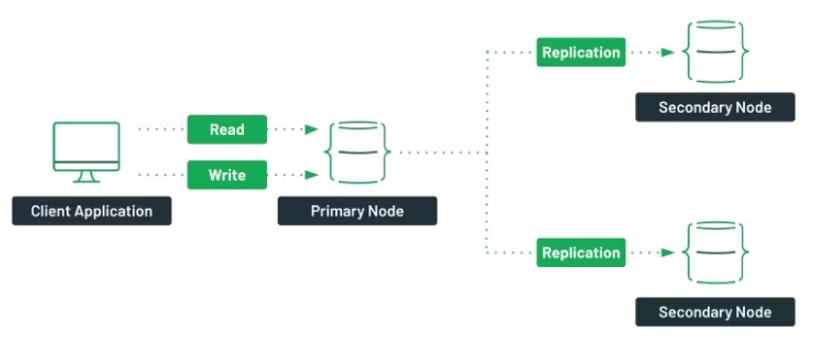

# Documentacao_de_comandos_docker_MongoCompass
Repositório com os comandos pra criar um replica set de 4 nós no Docker. Mostra como gerenciar pelo MongoDB Compass e simular a queda de um nó pra ver a eleição de um novo primário.

Requisitos:

Instalar o Docker Desktop no Windows:
[Docker-Install](https://www.docker.com/products/docker-desktop/)

Instalar o MongoDBCompass:
[MongoDBCompass-Install](https://www.mongodb.com/try/download/compass)